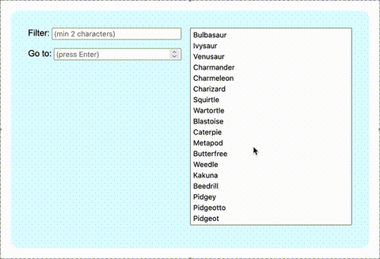

# Pokédex

A simple Pokédex in TypeScript and React. This project uses the [Pokémon API](https://pokeapi.co/).

Filter and select Pokemon to view their sprites and descriptions.

There is a newer version of this [here](https://github.com/andrewh7358/Pokedex-react).

## How to run

In the project directory, run `npm install` then `npm start`.

Open [http://localhost:3000](http://localhost:3000) to view it in your browser.
